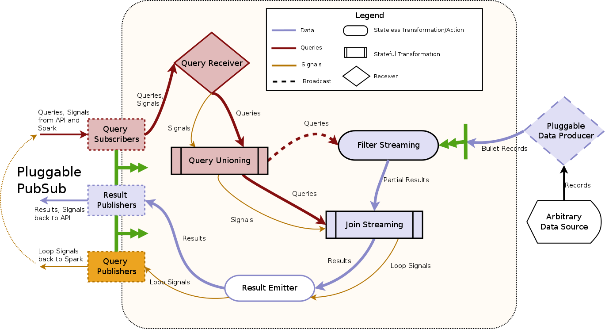

# Spark architecture

This section describes how the [Backend architecture](../index.md#backend) is implemented in Spark Streaming.

## Data Flow Graph

Bullet Spark implements the backend piece from the full [Architecture](../index.md#architecture). It is implemented with Spark Streaming:



The components in [Architecture](../index.md#architecture) have direct counterparts here. The Query Receiver reading from the PubSub layer using plugged-in PubSub consumers and the Query Unioning make up the Request Processor. The Filter Streaming and your plugin for your source of data make up the Data Processor. The Join Streaming and the Result Emitter make up the Combiner.

The red colored lines are the path for the queries that come in through the PubSub, the orange colored lines are the path for the signals and the blue is for the data from your data source. The shape of the boxes denotes the type of transformation/action being executed in the boxes.

### Data processing

Bullet can accept arbitrary sources of data as long as they can be ingested by Spark. They can be Kafka, Flume, Kinesis, and TCP sockets etc. In order to hook up your data to Bullet Spark, you just need to implement the [data producer](https://github.com/bullet-db/bullet-spark/blob/master/src/main/scala/com/yahoo/bullet/spark/DataProducer.scala). In your implementation, you can either:
* Use [Spark Streaming built-in sources](https://spark.apache.org/docs/latest/streaming-programming-guide.html#input-dstreams-and-receivers) to receive data. Below is a quick example for Kafka source which is written in Scala:

```scala
import com.yahoo.bullet.spark.DataProducer
import org.apache.spark.streaming.kafka010.{ConsumerStrategies, KafkaUtils, LocationStrategies}
// import all other necessary packages

class DirectKafkaProducer extends DataProducer {
  override def getBulletRecordStream(ssc: StreamingContext, config: BulletSparkConfig): DStream[BulletRecord] = {
    val topic = "test"
    val kafkaParams = Map[String, AnyRef](
      "bootstrap.servers" -> "server1, server2",
      "group.id" -> "mygroup",
      "key.deserializer" -> classOf[StringDeserializer],
      "value.deserializer" -> classOf[ByteArrayDeserializer]
      // Other kafka params
      )

    val directKafkaStream = KafkaUtils.createDirectStream[String, Array[Byte]](
      ssc,
      LocationStrategies.PreferConsistent,
      ConsumerStrategies.Subscribe[String, Array[Byte]](Set(topic), kafkaParams))

    directKafkaStream.map(record => {
      // Convert your record to BulletRecord
    })
  }
}
```

* Write a [custom receiver](https://spark.apache.org/docs/latest/streaming-custom-receivers.html) to receive data from any arbitrary data source beyond the ones for which it has built-in support (that is, beyond Flume, Kafka, Kinesis, files, sockets, etc.). See [example](https://github.com/bullet-db/bullet-db.github.io/tree/src/examples/spark).

After receiving your data, you can do any transformation in your implementation before emitting to Filter Streaming.

The Filter Streaming checks every record from your data source against every query from Query Unioning to see if it matches and emits partial results to the Join Streaming.

### Request processing

The Query Receiver fetches Bullet queries and signals through the PubSub layer using the Subscribers provided by the plugged in PubSub layer. The queries received through the PubSub also contain information about the query such as its unique identifier, potentially other metadata and signals. The Query Unioning collects all active queries by a stateful transformation updateStateByKey and broadcasts all the collected queries to every executor for the Filter Streaming to use.

The Query Unioning also send all active queries and signals to the Join Streaming.

### Combining

The Filter Streaming combines all the partial results from the Filter Streaming by a stateful transformation mapWithState and produces final results.

The Result Emitter uses the particular publisher from the plugged in PubSub layer to send back results/loop signals.
