# Performance of Bullet on Spark

This section describes how we tune the performance of Bullet on Spark. This is not meant to be a rigorous benchmark.

## Prerequisites

You should be familiar with [Spark Streaming](https://spark.apache.org/streaming/), [Kafka](http://kafka.apache.org) and the [Bullet on Spark architecture](spark-architecture.md).

##  How was this tested?

All tests run here were using [Bullet-Spark 0.1.2](https://github.com/bullet-db/bullet-spark/releases/tag/bullet-spark-0.1.2).

### Tools used

  * [jq](https://stedolan.github.io/jq/) - a nice tool to parse Bullet JSON responses
  * curl, bash and python - for running and analyzing Bullet queries
  * [Apache JMeter](https://jmeter.apache.org/) - a load testing tool to send multiple queries to the server simultaneously

### Cluster

* Hadoop YARN cluster with Apache Spark 2.1.2.12 installed
* The spec for the machines we were running on:
    - 2 x Intel E5530(4 cores, 8 Threads)
    - 24 GB RAM
    - 3 TB SATA Disk
    - 10 G Network Interface

### Data

* Our data was read from a Kafka cluster. Kafka version is 0.10.2.1
* The Kafka cluster was located within the same datacenter as the Hadoop YARN cluster - close network proximity gives us some measure of confidence that large data transmission delays aren't a factor.
* Our data schema contained ```92``` fields with ```62``` Strings, ```4``` Longs, ```23``` Maps and ```3``` Lists of Maps. Most of the data is generally present in the Maps and Lists of Maps.
* We tested 2 set of data:
    - The smaller data was about 36,000 records/s and 43 MB/s
    - The larger data was about 124,700 records/s and 150 MB/s

### Configuration

Here are the configurations we used to launch instances of Bullet Spark.

* For the smaller data:

Settings:
```YAML
bullet.spark.batch.duration.ms: 2000
bullet.spark.receiver.query.block.size: 1
bullet.result.metadata.enable: true
bullet.spark.metrics.enabled: true
bullet.spark.filter.parallel.enabled: true
bullet.spark.filter.parallelism: 16
bullet.spark.filter.parallel.query.min.size: 10
bullet.spark.query.union.checkpoint.duration.multiplier: 20
bullet.spark.join.checkpoint.duration.multiplier: 20
```
Command line:
```bash
./spark-submit \
  --master yarn \
  --deploy-mode cluster \
  --queue default \
  --executor-memory 12g \
  --executor-cores 2 \
  --num-executors 100 \
  --driver-cores 2 \
  --driver-memory 12g \
  --conf spark.streaming.backpressure.enabled=true \
  --conf spark.driver.extraJavaOptions="-XX:+UseG1GC" \
  --conf spark.executor.extraJavaOptions="-XX:+UseG1GC" \
  --conf spark.shuffle.consolidateFiles=true \
  --conf spark.dynamicAllocation.enabled=false \
  --conf spark.storage.memoryFraction=0.1 \
  --conf spark.shuffle.memoryFraction=0.8 \
  --conf spark.default.parallelism=20 \
  ...
```

* For larger Data:

Settings:
```YAML
bullet.spark.batch.duration.ms: 5000
bullet.spark.receiver.query.block.size: 1
bullet.result.metadata.enable: true
bullet.spark.metrics.enabled: true
bullet.spark.filter.parallel.enabled: true
bullet.spark.filter.parallelism: 64
bullet.spark.filter.parallel.query.min.size: 10
bullet.spark.query.union.checkpoint.duration.multiplier: 20
bullet.spark.join.checkpoint.duration.multiplier: 20
```
Command line:
```bash
./spark-submit \
  --master yarn \
  --deploy-mode cluster \
  --queue default \
  --executor-memory 12g \
  --executor-cores 2 \
  --num-executors 400 \
  --driver-cores 2 \
  --driver-memory 12g \
  --conf spark.streaming.backpressure.enabled=true \
  --conf spark.driver.extraJavaOptions="-XX:+UseG1GC" \
  --conf spark.executor.extraJavaOptions="-XX:+UseG1GC" \
  --conf spark.shuffle.consolidateFiles=true \
  --conf spark.dynamicAllocation.enabled=false \
  --conf spark.storage.memoryFraction=0.1 \
  --conf spark.shuffle.memoryFraction=0.8 \
  --conf spark.default.parallelism=50 \
  ...
```

## Test 1: Latency of Bullet Spark

This test was done on the smaller data. We used a [RAW query without any filtering](../ws/examples/#simplest-query) to measure the latency added by Bullet Spark. This is not the end-to-end latency for a query. It is the latency from receiving the query to finishing the query, not including the time spent in Kafka. We ran this query 100 times.

### Result

This graph shows the latency of each attempt:

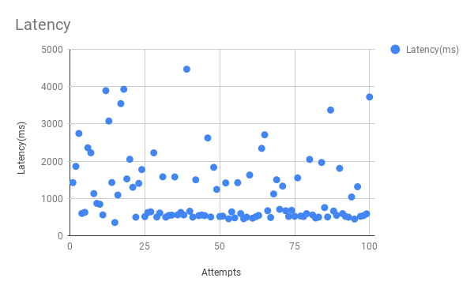

### Conclusion

The average latency was 1173 ms. This result shows that this is the fastest Bullet Spark can be. It cannot return data any faster than this for meaningful queries.

## Test 2: Scalability for smaller data

This test was done on the smaller data. We want to measure how many queries we can have running simultaneously on Bullet Spark. We ran 400, 800, 1500 and 1100 queries each for 10 minutes.

### Result

#### Figure 1. Spark Streaming UI

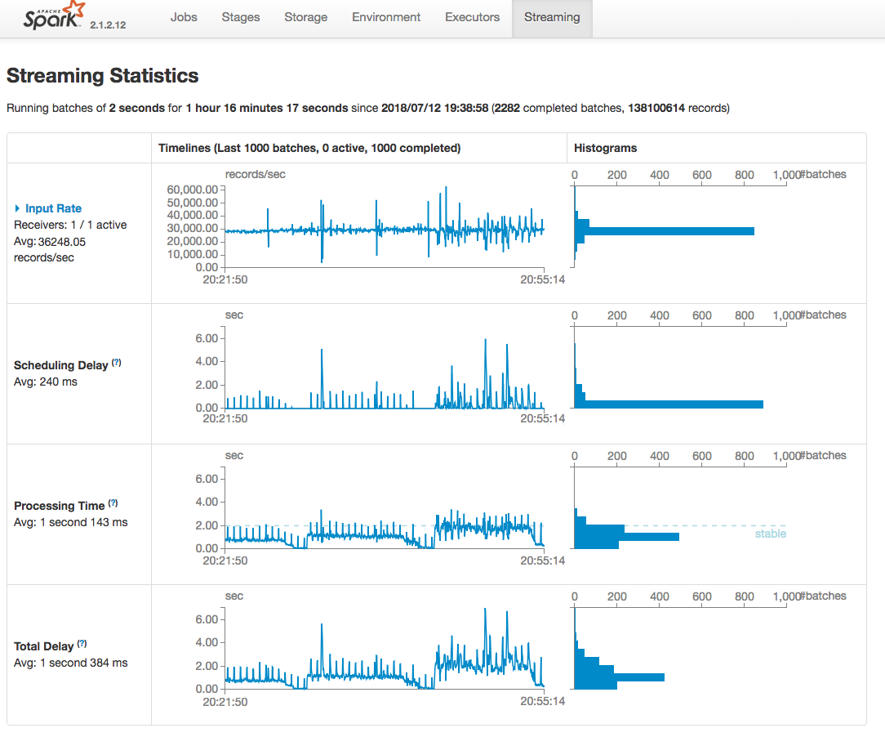

#### Figure 2. Queries running

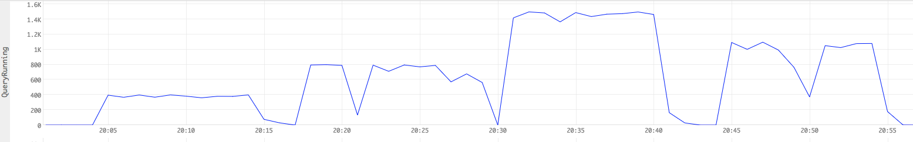

#### Figure 3. CPU time

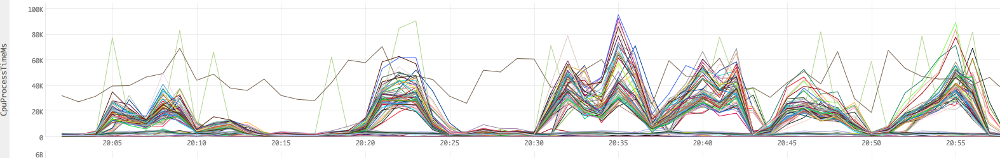

#### Figure 4. Heap usage

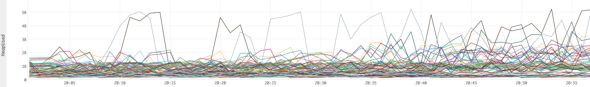

#### Figure 5. Garbage collection time

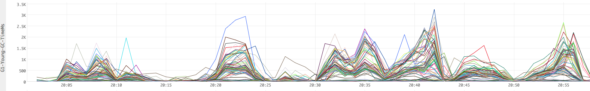

#### Figure 6. Garbage collection count

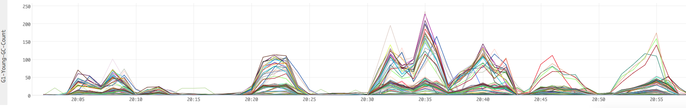

[Figure 1](#figure-1-spark-streaming-ui) shows the Spark Streaming UI when running the test.

[Figure 2](#figure-2-queries-running) shows the simultaneous queries we ran.

[Figure 3](#figure-3-cpu-time) shows the milliseconds of CPU time used per minute. For example, a value of ```300K ms``` ms for a line (worker) means that the worker used ```300K ms/min```  or ```300s/60s``` or ```5``` CPU cores (virtual) in that minute.

[Figure 4](#figure-4-heap-usage) shows raw numbers for Heap utilizations in bytes.

[Figure 5](#figure-5-garbage-collection-time) shows the time in milliseconds spent for garbage collection per minute.

[Figure 6](#figure-6-garbage-collection-count) shows the count of garbage collection events per minute.

### Conclusion

The average processing time for each batch was 1 second 143 ms which was below the batch duration 2 seconds. On average, 1 CPU core and 3GB memory were used in this experiment. CPU and memory usages go slowly up while queries number goes up but they are still within resource limits. We can easily run up to 1500 RAW queries simultaneously in this test.

## Test 3: Scalability for larger data

This test was done on the larger data. We ran 100, 400, 800 and 600 queries each for 10 minutes.

### Result

#### Figure 7. Spark stream UI

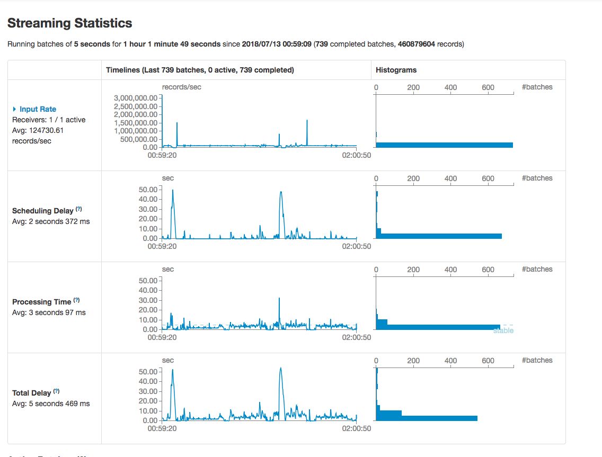

#### Figure 8. Queries running

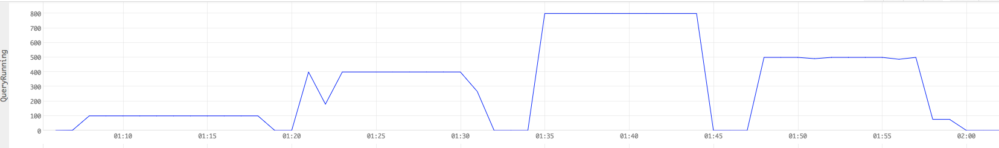

#### Figure 9. CPU time

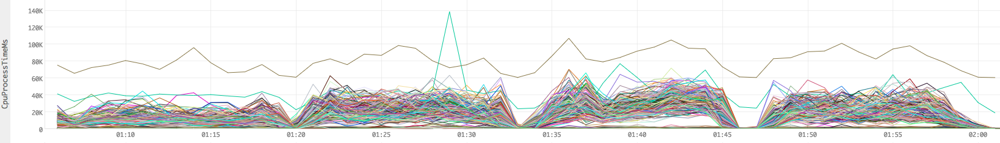

#### Figure 10. Heap usage

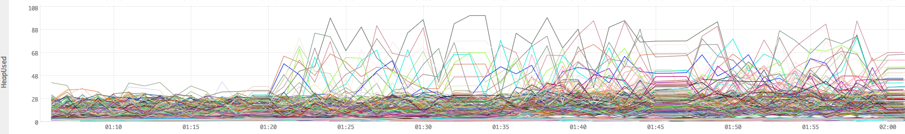

#### Figure 11. Garbage collection time

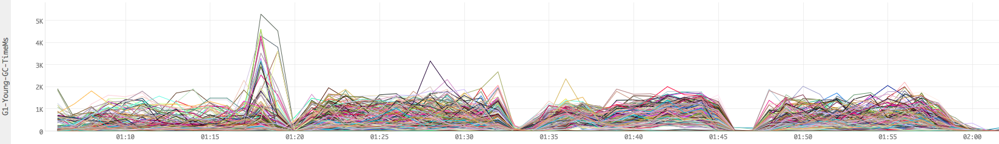

#### Figure 12. Garbage collection count

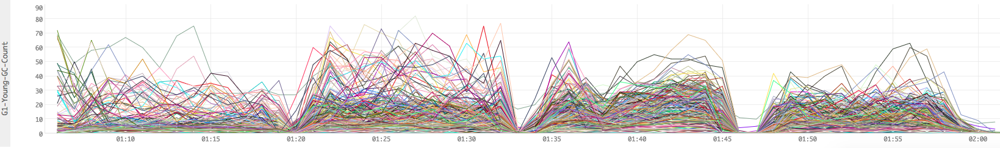

### Conclusion

The average processing time for each batch was 3 seconds 97 ms which was below the batch duration 5 seconds. On average, 1.2 CPU core and average 5GB memory were used in this experiment. But with queries number goes up, some of the executors memory usage were up to 8-10GB which is close to our resource limits. With more queries running, OOM may happen. So in this experiment, we can only afford up to 800 queries simultaneously.
