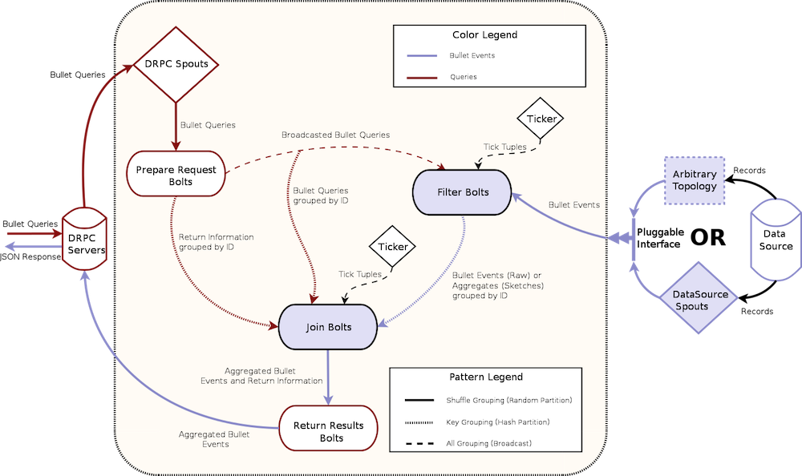

# Storm architecture

This section describes how the [Backend architecture](../index.md#backend) is implemented in Storm.

## Storm DRPC

Bullet on [Storm](https://storm.apache.org/) is built using [Storm DRPC](http://storm.apache.org/releases/1.0.0/Distributed-RPC.html). DRPC or Distributed Remote Procedure Call, is built into Storm and consists of a set of servers that are part of the Storm cluster. When a Storm topology that uses DRPC is launched, it registers a spout with a unique name (the procedure in the Distributed Remote Procedure Call) with the DRPC infrastructure. The DRPC Servers expose a REST endpoint where data can be POSTed to or a GET request can be made with this unique name. The DRPC infrastructure then sends the request (a query in Bullet) through the spout(s) to the topology that registered that name (Bullet). The result from topology is sent back to the client. We picked Storm to implement Bullet on first not only because it was the most popular Streaming framework at Yahoo but also since DRPC provides us a nice and simple way to handle getting queries into Bullet and sending responses back.

!!! note "Thrift and DRPC servers"

    DRPC also exposes a [Thrift](http://thrift.apache.org) endpoint but the Bullet Web Service uses REST for simplicity. When you launch your Bullet Storm topology, you can POST Bullet queries to a DRPC server directly with the function name that you specified in the Bullet configuration. This is a quick way to check if your topology is up and running!

## Topology

For Bullet on Storm, the Storm topology implements the backend piece from the full [Architecture](../index.md#architecture). The topology is implemented with the standard Storm spout and bolt components:



The components in [Architecture](../index.md#architecture) have direct counterparts here. The DRPC servers, the DRPC spouts, the Prepare Request bolts comprise the Request Processor. The Filter bolts and your plugin for your source of Data make up the Data Processor. The Join bolt and the Return Results bolt make up the Combiner.

The red colored lines are the path for the queries that come in through Storm DRPC and the blue is for the data from your data source. The pattern on the lines denote how the data (Storm tuples) is moved to the next component. Dashed indicates a broadcast (sent to all instances of the component), dotted indicates a key grouping (sent to a particular instance based on hashing on a particular field), and solid indicates a shuffle (randomly sent to an instance).

!!! note "What's a Ticker?"

    The Ticker component is attached to the Filter and Join Bolts produce Storm tuples at predefined intervals. This is a Storm feature (and is configurable when you launch the Bullet topology). These tuples, called tick tuples, behave like a CPU clock cycles for Bullet. Bullet performs all its system related activities on a tick. This includes purging stale queries, emitting left over data for queries, etc. We could have gone the route of having asynchronous threads that do the same thing but this was a far more simpler solution. The downside is that Bullet is as fast or as slow as its tick period, which can only go as low at 1 s in Storm. In practice, this means that your window is longer by a tick and you can accommodate that in your query if you wish.

    As a practical example of how Bullet uses ticks: when the final data is emitted from the Filter bolts when the query has expired, the Join bolt receiving it waits for 3 (this is configurable) ticks after *its query* expires to collect all the last intermediate results from the Filter bolts. If the tick period is set as high as 5 s, this means that a query will take 3 * 15 or 15 s to get back after its expiry! Setting it to 1 s, makes it 1 * 3 s. By changing the number of ticks that the Join bolt waits for and the tick period, you can get to any integral delay >= 1 s.

### Data processing

Bullet can accept arbitrary sources of data as long as they can be read from Storm. You can either:

1. Write a Storm spout that reads your data from where ever it is (Kafka etc) and [converts it to Bullet Records](ingestion.md). See [Quick Start](../quick-start.md#storm-topology) for an example.
2. Hook up an existing topology that is doing something else directly to Bullet. You will still write and hook up a component that converts your data into Bullet Records in your existing topology.

|          | Pros                                                                             | Cons                                                                                 |
| -------- | -------------------------------------------------------------------------------- | ------------------------------------------------------------------------------------ |
| Option 1 | Very simple to get started. Just implement a spout                               | Need a storage layer that your spout pulls or some system has to push to your spouts |
| Option 2 | Saves a persistence layer                                                        | Ties your topology to Bullet directly, making it affected by Storm Backpressure etc  |
| Option 2 | You can add bolts to do more processing on your data before sending it to Bullet | Increases the complexity of the topology                                             |

Your data is then emitted to the Filter bolt.  If you have no queries in your system, the Filter Bolt will promptly drop all Bullet Records and do absolutely nothing. If there are queries in the Filter bolt, the record is checked against the [filters](../index.md#filters) in each query and if it matches, it is processed by the query. Each query type can choose to emit matched records in micro-batches. By default, ```RAW``` or ```LIMIT``` queries do not micro-batch. Each matched record up to the maximum for the query is emitted at once at the Filter bolt. Queries that aggregate, on the other hand, keep the query around till its duration is up and emit the local result. This is because these queries *cannot* return till they see all the data in your time window anyway because some late arriving data may update an existing aggregate.

!!! note "Why support micro-batching?"

    ```RAW``` queries do not micro-batch by default, which makes Bullet really snappy when running those queries. As soon as your maximum record limit is reached, the query immediately returns. You can use a setting in [bullet_defaults.yaml](https://github.com/yahoo/bullet-storm/blob/master/src/main/resources/bullet_defaults.yaml) to turn on batching if you like. At some point in the future, micro-batching will let Bullet provide incremental results - partial results arrive over the duration of the query. Bullet can emit intermediate aggregations as they are all [additive](#combining).

### Request processing

Storm DRPC handles receiving REST requests for the whole topology. The DRPC spouts fetch these requests (DRPC knows the request is for the Bullet topology using the unique function name set when launching the topology) and shuffle them to the Prepare Request bolts. The request also contains information about how to return the response back to the DRPC servers. The Prepare Request bolts generate unique identifiers for each request (a Bullet query) and broadcasts them to every Filter bolt. Since every Filter bolt has a copy of every query, the shuffled data from the source of data can be compared against the query no matter which particular Filter bolt it ends up at. Each Filter bolt has access to the unique query id and is able to key group by the id to the Join bolt with the intermediate results for the query.

The Prepare Request bolt also key groups the query and the return information to the Join bolts. This means that the query will be assigned to one and only one Join bolt.

### Combining

Since the data from the Prepare Request bolt (a query and a piece of return information for the query) and the data from all Filter bolts (intermediate results) is key grouped by the unique query id, only one particular Join bolt receives both the query and all the intermediate results for a particular query. The Join bolt can then combine all the intermediate results and produce a final result. This final result is joined (hence the name) with the return information for the query and is shuffled to the Return Results bolt. This bolt then uses the return information to send the results back to a DRPC server, which then returns it back to the requester.

!!! note "Combining and operations"

    In order to be able to combine intermediate results and process data in any order, all aggregations that Bullet does need to be associative and have an identity. In other words, they need to be [Monoids](https://en.wikipedia.org/wiki/Monoid). Luckily for us, the [DataSketches](http://datasketches.github.io) that we use are monoids (actually are commutative monoids). Sketches can be unioned and thus all the aggregations we support - ```SUM```, ```COUNT```, ```MIN```, ```MAX```, ```AVG```, ```COUNT DISTINCT```, ```DISTINCT``` etc - are monoidal. (```AVG``` is monoidal if you store a ```SUM``` and a ```COUNT``` instead).


## Scalability

The topology set up this way scales horizontally and has some nice properties:

  * If you want to scale for processing more data but the same amount of queries, you only need to scale the components that read your data (the spout reading the data or your custom topology) and the Filter bolts.
  * If you want to scale for more queries but the same amount of data, you need to scale up the DRPC spouts, Prepare Request bolts, Join bolts and Return Results bolts. These components generally have low parallelism compared to your data since the data is generally much higher.

!!! note "More queries and Filter bolts"

    If you send more queries to the Filter bolt, it will be limited by at most how many queries a Filter bolt can store and still process data efficiently. Factors like CPU, memory allocations etc for the Filter bolts come in to the picture in addition to the parallelism. Generally, if you have allocated enough Filter bolts to process your data with enough head room, this should let you run hundreds of queries simultaneously before you run into these issues. In practice, since most usage is expected to be on large data volumes and 100s of queries simultaneously, you will need to scale the the Filter bolts out so that they are not slowed down by the large number of queries in each.
