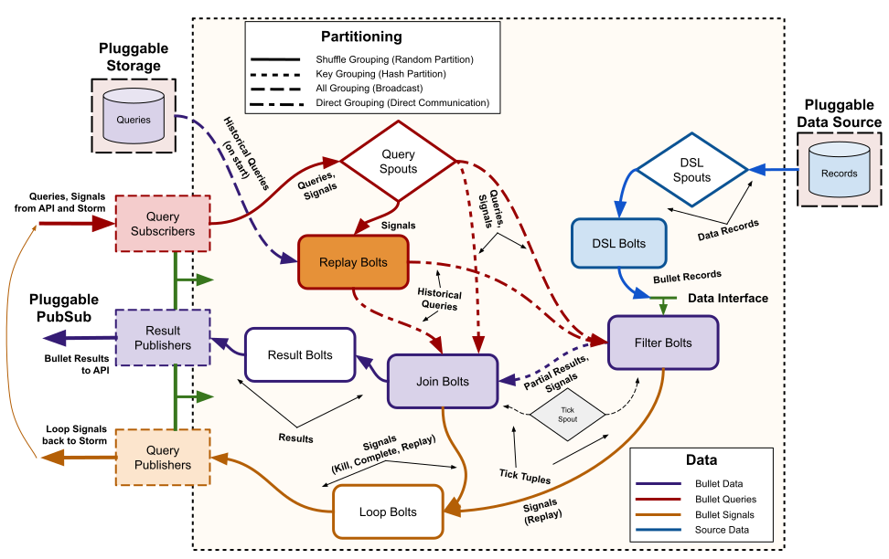

# Storm architecture

This section describes how the [Backend architecture](../index.md#backend) is implemented in Storm.

## Topology

For Bullet on Storm, the Storm topology implements the backend piece from the full [Architecture](../index.md#architecture). The topology is implemented with the standard Storm spout and bolt components:



The components in [Architecture](../index.md#architecture) have direct counterparts here. The Query spouts reading from the PubSub layer using plugged-in PubSub consumers make up the Request Processor. The Filter bolts and your plugin for your source of data (shown here using plugged with both the DSL spouts and DSL bolts from [Bullet DSL](#dsl.md)) make up the Data Processor. The Join bolt, the Loop bolt and the Result bolt make up the Combiner. There are peripheral components such as the Loop bolts, Tick spouts or the Replay bolts to handle metadata management in the topology.

The red colored lines are the path for the queries that come in through the PubSub, the blue is for the data from your data source and the orange is for metadata and loop-back signals used internally by the backend. The purple lines highlight the most important components where queries and data intermix (the Filter and Join bolts).

The pattern on the lines denote how the data (Storm tuples) is moved to the next component. Dashed indicates a broadcast (sent to all instances of the component), dotted indicates a key grouping (sent to a particular instance based on hashing on a particular field), solid indicates a shuffle (randomly sent to an instance) and dashed-dotted indicates a custom grouping.

!!! note "What's a Replay?"

    The Replay and the [pluggable storage](storm-setup.md#storage) are *optional components* in Bullet on Storm. They exist to replay existing queries if you plugged in a storage layer into the [API](#../ws/setup.md#storage). You would use this if you have long running queries and are not tolerant to losing queries for your use-case. Currently, we do not support storage intermediate results in the storage though. For instance, if you restart the topology but have storage and replay configured, you will recreate all the queries on startup but you will lose all intermediate results that were held in memory so far. We plan to add intermediate result storage as well soon!

!!! note "What's a Tick spout?"

    The Tick spout component produces Storm tuples at predefined intervals to the Filter and Join bolts. These tuples, called tick tuples, behave like CPU clock cycles for Bullet. Bullet performs all its system related activities on a tick. This includes purging stale queries, emitting left over data for queries, etc. We could have gone the route of having asynchronous threads that do the same thing but this was a far simpler solution. The downside is that Bullet is as fast or as slow as its tick period, which can be configured on launch (defaults to ```100 ms```). In practice, this means that your time-based windows need to be at least twice as long as your tick period.

    As a practical example of how Bullet uses ticks: when the final data is emitted from the Filter bolts when the query has expired, the Join bolt receiving it waits for 3 (this is configurable) ticks after *its query* expires to collect all the last intermediate results from the Filter bolts. If the tick period is set as high as 5 s, this means that a query will take 3 * 15 or 15 s to get back after its expiry! Setting it to 1 s, makes it 1 * 3 s. Similarly, intermediate windows are buffered (for certain kinds of windowed queries) to collect all results for that window before sending it back to the user.

### Data processing

Bullet can accept arbitrary sources of data as long as they can be read from Storm. You can either:

1. Write a Storm spout (or optionally topology) that reads your data from where ever it is (Kafka etc) and [converts it to Bullet Records](ingestion.md). See [Quick Start](../quick-start/storm.md#storm-topology) for an example.
2. Hook up an existing topology that is doing something else directly to Bullet. You will still write and hook up a component that converts your data into Bullet Records in your existing topology.
3. Use [Bullet DSL](dsl.md) to configure a DSL spout (and optionally a DSL bolt) to use the DSL interfaces to automatically understand your data source with its data format and convert it to the interface Bullet uses without code.

|                                                                                             | Option 1 | Option 2 | Option 3 |
| ------------------------------------------------------------------------------------------- | -------- | -------- | -------- |
| Write code to read from your data source and convert to Bullet records                      | Y        | Y        | N        |
| Write Storm spouts and/or bolts                                                             | Y        | Y        | N        |
| Saves a persistence/pubsub layer                                                            | N        | Y        | N        |
| Separate reading data from converting and allowing fan-out                                  | N        | Y        | Y        |
| Full control over how data is read, processed and converted to Bullet records               | Y        | Y        | N        |

Option 3 is generally flexible and is recommended. Having a code-less way to plug into Bullet is the fastest way to get started. We are adding new data sources and formats to the DSL so that we can support more ways to get your data into Bullet. If a connector or converter is not supported in DSL for your specific data source, you can also implement your own. It will save you from having to write Storm spouts or bolts and lets you reuse the Bullet DSL spout and/or bolt.

Regardless of how your data is read, it is then emitted to the Filter bolt. If you have no queries in your system, the Filter bolt will promptly drop all Bullet Records and do nothing. If there are queries in the Filter bolt, the record is checked against each query and if it matches, it is processed by the query. Each query type can choose when to emit its intermediate result based on what window is configured for it. Depending on this, the matched record could be immediately emitted (if it is a RAW query or the intermediate aggregate if anything else) or it could be buffered till a specific time is reached (or the query has expired).

### Request processing

The Query spouts fetch Bullet queries through the PubSub layer using the Subscribers provided by the plugged in PubSub layer. The queries received through the PubSub also contain information about the query such as its unique identifier and potentially other metadata. The Query spouts broadcasts the query body to every Filter bolt. Since every Filter bolt has a copy of every query, the shuffled data from the source of data can be compared against the query no matter which particular Filter bolt it ends up at. Each Filter bolt has access to the unique query id and is able to key group by the id to the Join bolt with the intermediate results for the query.

The Query spout also key groups the query and additional query metadata to the Join bolts. This means that the query and the metadata will be end up at exactly one Join bolt.


!!! note "Key grouping"

    Technically, Bullet uses a Custom grouping in Storm instead of Key grouping. The Custom grouping does the same thing as what the Key grouping would do in Storm. The reason why we use the Custom grouping is for Replay so that we can deterministically control the Join bolt component that will receive a query and reuse that information for certain aspects of replaying. This is just defensive programming in case Storm changes their key group algorithm to function differently.

### Combining

Since the data from the Query spout (query and metadata) and the data from all Filter bolts (intermediate results) is key grouped by the unique query id, only one particular Join bolt receives both the query and the intermediate results for a particular query. The Join bolt can then combine the intermediate results and produce a final result. This result is joined (hence the name) along with the metadata for the query and is shuffled to the Result bolts. This bolt then uses the particular Publisher from the plugged in PubSub layer and uses the metadata if it needs to and sends the results back through the PubSub layer to the requestor.

!!! note "Combining and operations"

    In order to be able to combine intermediate results and process data in any order, all aggregations that Bullet does need to be associative and have an identity. In other words, they need to be [Monoids](https://en.wikipedia.org/wiki/Monoid). Luckily for us, the [DataSketches](http://datasketches.github.io) that we use are monoids when exact (```COUNT DISTINCT``` and ```GROUP BY``` actually are commutative monoids). Sketches can be unioned and thus all the aggregations we support - ```SUM```, ```COUNT```, ```MIN```, ```MAX```, ```AVG```, ```COUNT DISTINCT```, ```DISTINCT``` etc - are monoidal. (```AVG``` is monoidal if you store a ```SUM``` and a ```COUNT``` instead). When ```DISTRIBUTION``` and ```TOP K``` Sketches are approximating, they may end up not being associative since they depend on the distribution of the data but you can think of them this way if you include their defined error functions bounding the result of the operation.

!!! note "Loop back"

    We have not mentioned the loop components or the replay bolts. These are mainly used to perform house-keeping within the topology or if you have configured storage/replay. For instance, there is a Rate Limit concept in the Bullet core libraries that if violated in any instance of the query being executed, should cause the query to be killed. Wherever this error originates, it will trickle to the Loop bolt and be looped back through the PubSub, through the Query spout and sent to all components that know about the query. These components will then kill the query as well. We call this a loop because strictly speaking, the topology is a Directed Acyclic Graph and we violate it by making a loop. These are also used to deliver external signals such as killing a query etc from the API or the UI. If you disable windows entirely, the Loop bolt will not be wired up when you launch your Bullet topology.

## Scalability

The topology set up this way scales horizontally and has some nice properties:

  * If you want to scale for processing more data but the same amount of queries, you only need to scale the components that read your data (the spout reading the data or your custom topology) and the Filter bolts.
  * If you want to scale for more queries but the same amount of data, you generally need to scale up the Filter bolts. If you need it, you can scale the Query spouts, Join bolts, Loop bolts and Result bolts. You should ensure that your PubSub layer (if you're using the Storm DRPC PubSub layer, then this is the number of DRPC servers in your Storm cluster) can handle the volume of queries and results being sent through it. These components generally have low parallelisms compared to your data processing components since the data volume is generally much higher than your query volume, so this is generally not needed.

See [Scaling for more Queries](storm-performance.md#test-7-scaling-for-more-queries) and [Scaling for more Data](storm-performance.md#test-6-scaling-for-more-data) for more details.

!!! note "More queries and Filter bolts"

    If you send more queries to the Filter bolt, it will be limited by at most how many queries a Filter bolt can store and still process data efficiently. Factors like CPU, memory allocations etc for the Filter bolts come in to the picture in addition to the parallelism. Generally, if you have allocated enough Filter bolts to process your data with enough head room, this should let you run hundreds of queries simultaneously before you run into these issues. In practice, since most usage is expected to be on large data volumes and 100s of queries simultaneously, you will need to scale the the Filter bolts out so that they are not slowed down by the large number of queries in each.
