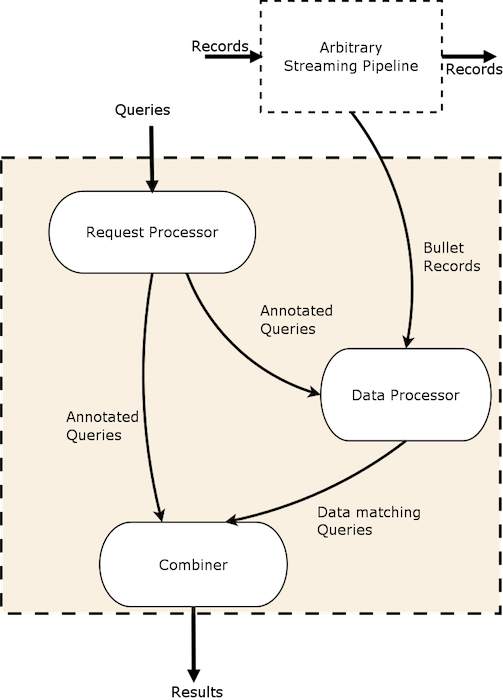

  

* A real-time query engine for very large data streams

* NO persistence layer

* Light-weight, cheap and fast

* Multi-tenant

* Pluggable to any data source

* Provides a UI and Web Service

* Filter raw data or aggregate data

* Can be run on storm or spark streaming

* A look-forward query system - operates on data that arrive after the query is submitted

* Big-data scale-tested - used in production at Yahoo and tested running 500+ queries simultaneously on up to 2,000,000 rps

# How is Bullet useful

How Bullet is used is largely determined by the data source it consumes. Depending on what kind of data you put Bullet on, the types of queries you run on it and your use-cases will change. As a look-forward query system with no persistence, you will not be able to repeat your queries on the same data. The next time you run your query, it will operate on the different data that arrives after that submission. If this usage pattern is what you need and you are looking for a light-weight system that can tap into your streaming data, then Bullet is for you!

### Example: How Bullet is used at Yahoo

Bullet is used in production internally at Yahoo by having it sit on a subset of raw user engagement events from Yahoo sites and apps. This lets Yahoo developers automatically validate their instrumentation code *end-to-end* in their Continuous Delivery pipelines. Validating instrumentation is critical since it powers pretty much all decisions and products including machine learning, corporate KPIs, analytics, personalization, targeting.

This instance of Bullet also powers other use-cases such as letting analysts validate assumptions about data, product managers verify launches instantly, debug issues and outages, or simply explore and play around with the data.

!!! note "Blog post"

    Here is a [link to our blog post](https://yahooeng.tumblr.com/post/161855616651/open-sourcing-bullet-yahoos-forward-looking) condensing most of this information if you want to take a look.

---

# Quick Start

See [Quick Start](quick-start/spark.md) to set up Bullet locally using Spark Streaming. You will generate some synthetic streaming data that you can then query with Bullet.

# Setup Bullet on your streaming data

To set up Bullet on a real data stream, you need:

1. To setup the Bullet Backend on a stream processing framework. Currently, we support [Bullet on Storm](backend/storm-setup.md) and [Bullet on Spark](backend/spark-setup.md).
    1. Plug in your source of data. See [Data Ingestion](backend/ingestion.md) or the [DSL](backend/dsl.md) for details
    2. Consume your data stream
2. The [Web Service](ws/setup.md) set up to convey queries and return results back from the backend
3. To choose a [PubSub implementation](pubsub/architecture.md) that connects the Web Service and the Backend. We currently support [Kafka](pubsub/kafka.md) and a [REST PubSub](pubsub/rest.md) on any Backend and [Storm DRPC](pubsub/storm-drpc.md) for the Storm Backend.
4. The optional [UI](ui/setup.md) set up to talk to your Web Service. You can skip the UI if all your access is programmatic

!!! note "Schema in the UI"

    The UI also needs an endpoint that provides your data schema to help with query building. The Web Service you set up provides a simple file based schema endpoint that you can point the UI to if that is sufficient for your needs.

---

# Querying in Bullet

Bullet queries allow you to filter, project and aggregate data. You can also specify a window to get incremental results. Bullet lets you fetch raw (the individual data records) as well as aggregated data.

* See the [UI Usage section](ui/usage.md) for using the UI to build Bullet queries. This is the same UI you will build in the Quick Starts.

* See the API section ([BQL](ws/api-bql.md), or the more verbose, underlying query format - [JSON](ws/api-json.md)) for building Bullet API queries

* For examples using the API, see [Examples](ws/examples.md). These are actual albeit cleansed queries sourced from the instance at Yahoo.

## Termination conditions

A Bullet query terminates and returns whatever has been collected so far when:

1. A maximum duration is reached. In other words, a query runs for a defined time window (which can be infinite).
2. A maximum number of records is reached (only applicable for queries that are fetching raw data records and not aggregating).

## Filters

Bullet supports two kinds of filters:

| Filter Type        | Meaning |
| ------------------ | ------- |
| Logical filter     | Allow you to combine filter clauses (Logical or Relational) with logical operations like AND, OR and NOTs |
| Relational filters | Allow you to use comparison operations like equals, not equals, greater than, less than, regex like etc, on fields |

## Projections

Projections allow you to pull out only the fields needed and rename them when you are querying for raw data records.

## Aggregations

Aggregations allow you to perform some operation on the collected records.

The current aggregation types that are supported are:

| Aggregation    | Meaning |
| -------------- | ------- |
| GROUP          | The resulting output would be a record containing the result of an operation for each unique value combination in your specified fields |
| COUNT DISTINCT | Computes the number of distinct elements in the fields. (May be approximate) |
| LIMIT or RAW   | The resulting output would be at most the number specified in size. |
| DISTRIBUTION   | Computes distributions of the elements in the field. E.g. Find the median value or various percentile of a field, or get frequency or cumulative frequency distributions |
| TOP K          | Returns the top K most frequently appearing values in the column |

Currently we support ```GROUP``` aggregations with the following operations:

| Operation      | Meaning |
| -------------- | ------- |
| COUNT          | Computes the number of the elements in the group |
| SUM            | Computes the sum of the non-null values in the provided field for all elements in the group |
| MIN            | Returns the minimum of the non-null values in the provided field for all the elements in the group |
| MAX            | Returns the maximum of the non-null values in the provided field for all the elements in the group |
| AVG            | Computes the average of the non-null values in the provided field for all the elements in the group |

If you ```GROUP``` with no operation, you are performing a ```DISTINCT``` on the field(s). If you ```GROUP``` with no field(s), you are performing the operation(s) across all your data.

## Post Aggregations

Post Aggregations let you perform some operation before finalizing and returning the results to you. This is applied every time a result is returned to you (see below). The current operations supported are:

| Post Aggregation | Meaning |
| ---------------- | ------- |
| ORDER BY         | Orders your result by your specified fields in ascending or descending order |
| COMPUTATION      | Specify an expression (can be nested expressions) [here](ws/api-json.md#expressions) to do math with or cast fields in your result |

## Windows

Windows in a Bullet query allow you to specify how often you'd like Bullet to return results.

For example, you could launch a query for 2 minutes, and have Bullet return a COUNT DISTINCT on a particular field every 3 seconds:


See documentation on the Web Service API for more info.

# Results

The Bullet Web Service returns your query result as well as associated metadata information in a structured JSON format. The UI can display the results in different formats.

---

# Approximate computation

It is often intractable to perform aggregations on an unbounded stream of data and still support arbitrary queries. However, it is possible if an exact answer is not required and the approximate answer's error is exactly quantifiable. There are stochastic algorithms and data structures that let us do this. We use [Data Sketches](https://datasketches.github.io/) to perform aggregations such as counting uniques, and will be using Sketches to implement some future aggregations.

Sketches let us be exact in our computation up to configured thresholds and approximate after. The error is very controllable and quantifiable. All Bullet queries that use Sketches return the error bounds with Standard Deviations as part of the results so you can quantify the error exactly. Using Sketches lets us address otherwise hard to solve problems in sub-linear space. We uses Sketches to compute ```COUNT DISTINCT```, ```GROUP```, ```DISTRIBUTION``` and ```TOP K``` queries.

We also use Sketches as a way to control high cardinality grouping (group by a natural key column or related) and rely on the Sketching data structure to drop excess groups. It is up to you setting up Bullet to determine to set Sketch sizes large or small enough for to satisfy the queries that will be performed on that instance of Bullet.

# Architecture

## End-to-End Architecture


The image above shows how the various pieces of the Bullet interact at a high-level. All these layers are modular and pluggable. You can choose an implementation for the Backend and the PubSub (or create your own). The core of Bullet is abstracted into a [library](https://github.com/yahoo/bullet-core) that can be reused to implement the Backend, Web Service and PubSub layers in a platform agnostic manner.

---

## Backend



The Bullet Backend can be split into three main conceptual sub-systems:

1. Request Processor - receives queries, adds metadata and sends it to the rest of the system
2. Data Processor - reads data from a input stream, converts it to an unified data format and matches it against queries
3. Combiner - combines results for different queries, performs final aggregations and returns results

The core of Bullet querying is not tied to the Backend and lives in a core library. This allows you implement the flow shown above in any stream processor you like.

Implementations of [Bullet on Storm](backend/storm-architecture.md) and [Bullet on Spark](backend/spark-architecture.md) are currently supported.

## PubSub

The PubSub is responsible for transmitting queries from the API to the Backend and returning results back from the Backend to the clients. It decouples whatever particular Backend you are using with the API.
We currently support four different PubSub implementations:

* [Kafka](pubsub/kafka.md)
* [REST](pubsub/rest.md)
* [Pulsar](pubsub/pulsar.md)
* [Storm DRPC](pubsub/storm-drpc.md) (only for non-windowed queries)

You can also very easily [implement your own](pubsub/architecture.md#implementing-your-own-pubsub) by defining a few interfaces that we provide.

## Web Service and UI

The rest of the pieces are just the standard other two pieces in a full-stack application:

  * A Web Service that talks to the backend using the PubSub layer
  * A UI that talks to this Web Service

The [Bullet Web Service](ws/examples.md) is built using [Spring Boot](https://projects.spring.io/spring-boot/) in Java and the [UI](ui/usage.md) is built in [Ember](emberjs.com).

The Web Service can be deployed as a standalone Java application (a JAR file) or easily rebuilt as a WAR to deploy your favorite servlet container like [Jetty](http://www.eclipse.org/jetty/). The UI is a client-side application that can be served using [Node.js](http://nodejs.org/)

!!! note "Want to know more?"

    In practice, the backend is implemented using the basic components that the Stream processing framework provides. See [Storm Architecture](backend/storm-architecture.md) and [Spark Architecture](backend/spark-architecture.md) for details.
