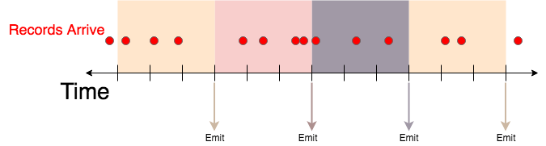
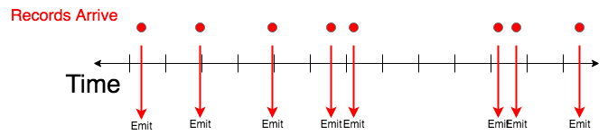

# Bullet JSON API

This section gives a comprehensive overview of the Web Service API for launching Bullet JSON queries.

The JSON API is the actual Query format that is expected by the backend. [The BQL API](api-bql.md) is a more user-friendly API which can also be used - the Web Service will automatically detect the BQL query and convert the query to this JSON format before submitting it to the backend. With the addition of Post Aggregations and Expressions,
it is a lot easier to use BQL rather than construct the JSON. The Bullet Web Service also provides [an API](https://github.com/bullet-db/bullet-service/releases/tag/bullet-service-0.4.2) to convert BQL to JSON if you so desire.

* For info on how to use the UI, see the [UI Usage section](../ui/usage.md)
* For examples of specific queries see the [Examples](examples.md) section

## Constituents of a Bullet Query

The main constituents of a Bullet JSON query are:

* __filters__, which determine which records will be consumed by your query
* __projection__, which determines which fields will be projected in the resulting output from Bullet
* __aggregation__, which allows you to aggregate data and perform aggregation operations
* __postAggregations__, which allows you to perform post aggregations before the result is returned
* __window__, which can be used to return incremental results on "windowed" data
* __duration__, which determines the maximum duration of the query in milliseconds


The main constituents of a Bullet query listed above create the top level fields of the Bullet query:
```javascript
{
    "filters": [{}, {}, ...],
    "projection": {},
    "aggregation": {},
    "postAggregations": [{}, {}, ...],
    "window": {},
    "duration": 20000
}
```

### Accessing Complex Fields

Fields inside maps and lists can be accessed using the '.' notation in queries.

| Complex Field Type       | Example                |
| ------------------------ | ---------------------- |
| Map of Primitive         | `myMap.key`            |
| Map of Map of Primitive  | `myMap.myInnerMap.key` |
| List of Map/Primitive    | `myList.0`             |
| List of Map of Primitive | `myListOfMaps.4.key`   |

We will now describe how to specify each of these top-level fields below:

## Filters

Bullet supports two kinds of filters:

1. Logical filters
2. Relational filters

### Logical Filters

Logical filters allow you to combine other filter clauses with logical operations like ```AND```, ```OR``` and ```NOT```.

The current logical operators allowed in filters are:

| Logical Operator | Meaning |
| ---------------- | ------- |
| AND              | All filters must be true. The first false filter evaluated left to right will short-circuit the computation. |
| OR               | Any filter must be true. The first true filter evaluated left to right will short-circuit the computation. |
| NOT              | Negates the value of the first filter clause. The filter is satisfied iff the value is true. |

The format for a __single__ Logical filter is:

```javascript
{
   "operation": "AND | OR | NOT"
   "clauses": [
      {"operation": "...", clauses: [{}, ...]},
      {"field": "...", "operation": "", values: ["..."]},
      {"operation": "...", clauses: [{}, ...]}
      ...
   ]
}
```

Any other type of filter may be provided as a clause in clauses.

Note that the "filter" field in the query is a __list__ of as many filters as you'd like.

### Relational Filters

Relational filters allow you to specify conditions on a field, using a comparison operator and a list of constant values or other fields.

The current comparisons allowed in filters are:

| Comparison    | Meaning |
| ------------- | ------- |
| ==            | Equal to any value in values |
| !=            | Not equal to any value in values |
| <=            | Less than or equal to any value in values |
| >=            | Greater than or equal to any value in values |
| <             | Less than any value in values |
| >             | Greater than any value in values |
| RLIKE         | Matches using [Java Regex notation](http://docs.oracle.com/javase/7/docs/api/java/util/regex/Pattern.html), any Regex value in values |
| SIZEIS        | If a map, list, or string has a given size |
| CONTAINSKEY   | If a map field contains the given key. This map field can be a top level map field or a map field inside a list of maps |
| CONTAINSVALUE | If a map field or a list field contains the given value. If the list contains maps instead of primitives, the values in the maps are used |

Note: These operators are all typed based on the type of the __left hand side__ from the Bullet record. If the elements on the right hand side cannot be
casted to the types on the LHS, those items will be ignored for the comparison.

The format for a Relational filter is:

```javascript
{
    "operation": "== | != | <= | >= | < | > | RLIKE | SIZEIS | CONTAINSKEY | CONTAINSVALUE"
    "field": "record_field_name | map_field.subfield",
    "values": [
        { "kind": "VALUE", "type": "BOOLEAN | INTEGER | LONG | FLOAT | DOUBLE | STRING | MAP | LIST", "value": "foo"},
        { "kind": "FIELD", "type": "BOOLEAN | INTEGER | LONG | FLOAT | DOUBLE | STRING | MAP | LIST", "value": "another_record_field_name"}
    ]
}
```

Note that you may specify ```VALUE``` or ```KIND``` currently for the ```kind``` key in the entries in the ```values``` field above, denoting the type of value this is. The ```type``` field is a *optional* and is provided to change the type of the provided ```kind``` (value or field) to the provided type. If you do not provide this type, the value or field provided here will be *casted* to the type of the field (the LHS of the filter).

As a shortcut, you can also specify the following format for ```VALUE``` kind.

```javascript
{
    "operation": "== | != | <= | >= | < | > | RLIKE | SIZEIS | CONTAINSKEY | CONTAINSVALUE"
    "field": "record_field_name | map_field.subfield",
    "values": [
        "string values",
        "that go here",
        "will be casted",
        "to the",
        "type of field"
    ]
}
```

You may __not__ mix and match both styles in the same filter.

*Multiple top level relational filters behave as if they are ANDed together.* This is supported as a convenience to do a bunch of ```AND```ed relational filters without having to nest them in a logical clause.

## Projections
Projections allow you to pull out only the fields needed and rename them (renaming is being supported in order to give
better names to fields pulled out from maps). If projections are not specified, the entire record is returned. If you are querying
for raw records, you can use projections to help reduce the load on the system and network.

```javascript
{
    "fields": {
        "fieldA": "newNameA",
        "fieldB": "newNameB"
    }
}
```

## Aggregations

Aggregations allow you to perform some operation on the collected records. They take an optional size to restrict
the size of the aggregation (this applies for aggregations high cardinality aggregations and raw records).

The current aggregation types that are supported are:

| Aggregation    | Meaning |
| -------------- | ------- |
| GROUP          | The resulting output would be a record containing the result of an operation for each unique group in the specified fields |
| COUNT DISTINCT | Computes the number of distinct elements in the fields. (May be approximate) |
| LIMIT          | The resulting output would be at most the number specified in size. |
| DISTRIBUTION   | Computes distributions of the elements in the field. E.g. Find the median value or various percentile of a field, or get frequency or cumulative frequency distributions |
| TOP K          | Returns the top K most frequently appearing values in the column |

The current format for an aggregation is:

```javascript
{
    "type": "GROUP | COUNT DISTINCT | TOP | PERCENTILE | RAW",
    "size": <a limit on the number of resulting records>,
    "fields": {
        "fields": "newNameA",
        "that go here": "newNameB",
        "are what the": "newNameC",
        "aggregation type applies to": "newNameD"
    },
    "attributes": {
        "these": "change",
        "per": [
           "aggregation type"
        ]
    }
}
```

You can also use ```LIMIT``` as an alias for ```RAW```. ```DISTINCT``` is also an alias for ```GROUP```. These exist to make some queries read a bit better.

Currently we support GROUP aggregations on the following operations:

| Operation      | Meaning |
| -------------- | ------- |
| COUNT          | Computes the number of the elements in the group |
| SUM            | Computes the sum of the elements in the group |
| MIN            | Returns the minimum of the elements in the group |
| MAX            | Returns the maximum of the elements in the group |
| AVG            | Computes the average of the elements in the group |


### Attributes

The ```attributes``` section changes per aggregation ```type```.

#### GROUP

The following attributes are supported for ```GROUP```:

```javascript
    "attributes": {
        "operations": [
            {
                "type": "COUNT",
                "newName": "resultColumnName"
            },
            {
                "type": "SUM",
                "field": "fieldName",
                "newName": "resultColumnName"
            },
            {
                "type": "MIN",
                "field": "fieldName",
                "newName": "resultColumnName"
            },
            {
                "type": "MAX",
                "field": "fieldName",
                "newName": "resultColumnName"
            },
            {
                "type": "AVG",
                "field": "fieldName",
                "newName": "resultColumnName"
            }
        ]
    }
```

You can perform ```SUM```, ```MIN```, ```MAX```, ```AVG``` on non-numeric fields. Bullet will attempt to *cast the field to a number first.* If it cannot, that record with the field will be ignored for the operation. For the purposes of ```AVG```, Bullet will
perform the average across the numeric values for a field only.

#### COUNT DISTINCT

The following attributes are supported for ```COUNT DISTINCT```:

```javascript
    "attributes": {
        "newName": "resultCountColumnName"
    }
```

Note that the new names you specify in the fields map for aggregations do not apply. You must use the attributes here to give your resulting output count column a name.

#### DISTRIBUTION

The following attributes are supported for ```DISTRIBUTION```:

```javascript
    "attributes": {
        "type": "QUANTILE | PMF | CDF",
        "numberOfPoints": <a number of evenly generated points to generate>,
        "points": [ a, free, form, list, of, numbers ],
        "start": <a start of the range to generate points>,
        "end": <the end of the range to generate points>,
        "increment": <the increment between the generated points>,
    }
```

You *must* specify one and only one field using the ```fields``` section in ```aggregation```. Any ```newName``` you provide will be ignored.

The ```type``` field picks the type of distribution to apply.

|   Type   |    Meaning    |
| -------- | ------------- |
| QUANTILE | Lets you pick out percentiles of the numeric field you provide. |
| PMF      | The Probability Mass Function distribution lets you get frequency counts and probabilities of ranges or intervals of your numeric field |
| CDF      | The Cumulative Distribution Function distribution lets you get cumulative frequency counts instead and is otherwise similar to PMF |

Depending on what ```type``` you have chosen, the rest of the attributes define *points in the domain* of that distribution.

For ```QUANTILE```, the points you define will be the *values* to get the percentiles from. These percentiles are represented as numbers between 0 and 1. This means that your points *must* be between 0 and 1.

For ```PMF``` and ```CDF```, the points you define will *partition* the range of your field values into intervals, with the first interval going from -&infin; to the first point and the last interval from your last point to +&infin;. This means that if you generate *N* points, you will receive *N+1* intervals. The points you define should be in the range of the values for your field to get a meaningful distribution. The domain for your points is therefore, all real numbers but you should narrow down to valid values for the field to get meaningful results.

You have three options to generate points.

|           Method           |    Keys          |
| -------------------------- | ---------------- |
| Number of Points           | You can use the ```numberOfPoints``` key to provide a number of points to generate evenly distributed in the full range of your domain |
| Generate Points in a range | You can use ```start```, ```end``` and ```increment``` (```start``` < ```end```, ```increment``` > 0) to specify numbers to generate points in a narrower region of your domain |
| Specify free-form points   | You can specify a free-form *array* of numbers which will be used as the points |

Note that If you specify more than one way to generate points, the API will use ```numberOfPoints```, followed by ```points```, followed by ```start```, ```end``` and ```increment``` and whichever creates valid points will be used first.

For ```PMF``` and ```CDF```, no matter how you specify your points, the first interval will always be *(-&infin;, first point)* and the last interval will be *[last point, +&infin;)*. You will also get a probability of how likely a value will land in the interval per interval in addition to a frequency (or cumulative frequency) count.

As with ```GROUP```, Bullet will attempt to *cast* your field into a numeric type and ignore it if it cannot.

#### TOP K

The following attributes are supported for ```TOP K```:

```javascript
  "attributes": {
      "threshold": <restrict results to having at least this count value>,
      "newName": "resultCountColumnName"
  }
```

Note that the ```K``` in ```TOP K``` is specified using the ```size``` field in the ```aggregation``` object.

## Post Aggregations

Post Aggregations allow you to perform some final operations on the aggregated data before it is returned, as the name suggests. It is **optional** and it is performed for each window. For example, you can cast your result field into another type or perform some math.

| Post Aggregation | Meaning |
| ---------------- | ------- |
| ORDER BY         | Orders your result by your specified fields in ascending or descending order |
| COMPUTATION      | Specify an expression (can be nested expressions) to do math with or cast fields in your result |

The ```"postAggregations"``` field takes a list of these Post Aggregation entries. The __order__ of the various post aggregations in this list determines how they are evaluated. Post aggregations can refer to previous results of post aggregations in the list to chain them.

### ORDER BY

This orders result records based on given fields (in ascending order by default). To sort the records in descending order, use the ```DESC``` ```direction```. You can specify any fields in each record or from previous post aggregations. Note that the ordering is fully typed, so the types of the fields will be used. If multiple fields are specified, ties will be broken from the list of fields from left to right.

```javascript
{
  "type": "ORDERBY",
  "fields": ["A", "B"],
  "direction": "DESC"
}
```

### COMPUTATION

This lets you perform arithmetic on the results in a fully nested way. We currently support ```+```, ```-```, ```*``` and ```/``` as operations. The format for this is:

```javascript
{
  "type": "COMPUTATION",
  "expression": {}
}
```

#### Expressions

For future extensibility, the ```expression``` in the post aggregation is free form. Currently, we support binary arithmetic operations that can be nested (implying parentheses). This forms a tree of expressions. The leaves of this tree resolve atomic values such as fields or constants. So, there are two kinds of expressions.

##### Binary Expressions

```javascript
{
  "operation": "+",
  "left": {},
  "right": {},
  "type": "INTEGER | FLOAT | BOOLEAN | DOUBLE | LONG | STRING"
}
```
, where ```left``` and ```right``` are themselves expressions and ```type``` is used for force cast the result to the given type.

##### Unary Expressions

```javascript
{
  "value": {
    "kind": "FIELD | VALUE",
    "value": "foo.bar",
    "type": "INTEGER | FLOAT | BOOLEAN | DOUBLE | LONG | STRING"
  }
}
```

These is the same definition value used for filtering mentioned above and can be used to extract fields from the record as your chosen type or use constants as your chosen type.

If casting __fails__ in any of the expressions, the expression is ignored.

Putting all these together, here is a complete example of post aggregation. This first force computes a new field C, which is the result of doing ```(CAST(foo.bar, LONG) + CAST((CAST(1.2, DOUBLE)/CAST(1, INTEGER)), FLOAT)``` or (C: foo.bar + (1.2/1) for each record in the result window and then orders the result by foo.baz first then by the new the field C.

##### Post Aggregation Example

```javascript
{
   "postAggregations":[
      {
         "type":"COMPUTATION",
         "expression":{
            "operation":"+",
            "left":{
               "value":{
                  "kind":"FIELD",
                  "value":"foo.bar",
                  "type":"LONG"
               }
            },
            "right":{
               "operation":"/",
               "left":{
                  "value":{
                     "kind":"VALUE",
                     "value":"1.2",
                     "type":"DOUBLE",
                  }
               },
               "right":{
                  "value":{
                     "kind":"VALUE",
                     "value":"1",
                     "type":"INTEGER"
                  }
               },
               "type":"FLOAT"
            },
            "newName":"C"
         }
      },
      {
         "type":"ORDERBY",
         " fields":[
            "foo.baz", "C"
         ],
         "direction":"ASC"
      }
   ]
}
```

## Window

The "window" field is **optional** and allows you to instruct Bullet to return incremental results. For example you might want to return the COUNT of a field and return that count every 2 seconds.

If "window" is omitted Bullet will emit only a single result at the very end of the query.

An example window might look like this:

```javascript
"window": { "emit": { "type": "TIME/RECORD", "every": 5000 },
            "include": { "type": "TIME/RECORD/ALL", "first": 5000 } },
```

| Field   | SubField | Meaning |
| ------- | --------- | ------- |
| emit    |           | This object specifies when a window should be emitted and the current results sent back to the user |
|         | type      | Must be "TIME" or "RECORD" - specifying if the window should be emitted after X number of milliseconds, or X number of records |
|         | every     | The number of milliseconds or records (determined by "type" above) that will be contained in the emitted window |
| include |           | This object specifies what will be included in the emitted window |
|         | type      | Must be "TIME", "RECORD" or "ALL" - specifying if the window should include X number of milliseconds, X number of records, or all results since the beginning of the whole query |
|         | first     | Specifies the number of records/milliseconds at the beginning of this window to include in the emitted result - it should be omitted if "type" is "ALL" |

**NOTE: Not all windowing types are supported at this time.**

**Currently Bullet supports the following window types**:

* Time-Based Tumbling Windows
* Additive Tumbling Windows
* Reactive Record-Based Windows
* No Window

Support for more windows will be added in the future.

Each currently supported window type will be described below:

#### **Time-Based Tumbling Windows**

Currently time-based tumbling windows **must** have emit == include. In other words, only the entire window can be emitted, and windows must be adjacent.



The above example windowing would be specified with the window:

```javascript
"window": { "emit": { "type": "TIME", "every": 3000 },
            "include": { "type": "TIME", "first": 3000 } },
```

Any aggregation can be done in each window, or the raw records themselves can be returned as specified in the "aggregation" object.

In this example the first window would include 3 records, the second would include 4 records, the third would include 3 records and the fourth would include 2 records.

#### **Additive Tumbling Windows**

Additive tumbling windows emit with the same logic as time-based tumbling windows, but include ALL results from the beginning of the query:


The above example would be specified with the window:

```javascript
"window": { "emit": { "type": "TIME", "every": 3000 },
            "include": { "type": "ALL" } },
```

In this example the first window would include 3 records, the second would include 7 records, the third would include 10 records and the fourth would include 12 records.

#### **Sliding Windows**

Sliding windows emit based on the arrival of an event, rather than after a certain period of time. In general sliding windows often do some aggregation on the previous X records, or on all records that arrived in the last X seconds. At this time, Bullet only supports sliding windows on the previous X records. It does not support sliding windows with any aggregation but ```RAW``` at this time. If you set X to 1, the query will effectively return each record as they arrive to the user.



The above example would be specified with the window (you may replace every and last with higher values):

```javascript
"window": { "emit": { "type": "RECORD", "every": 1 },
            "include": { "type": "RECORD", "last": 1 } },
```

#### **No Window**

If the "window" field is optional. If it is  omitted, the query will only emit when the entire query is finished.

## Results

Bullet results are JSON objects with two fields:

| Field   | Contents |
| ------- | -------- |
| records | This field contains the list of matching records |
| meta    | This field is a map that contains meta information about the query, such as the time the query was received, error data, etc. These are configurable at launch time. |

For a detailed description of how to perform these queries and see example results, see [Examples](examples.md).
