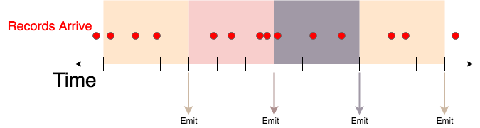
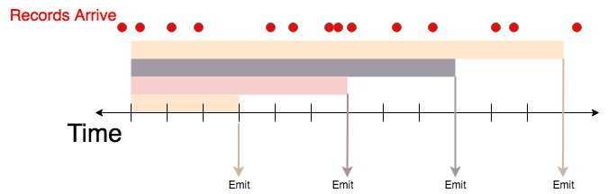
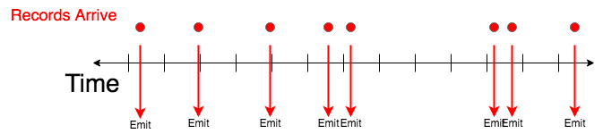

# API

This section gives a comprehensive overview of the Web Service API for launching Bullet queries.

* For info on how to use the UI, see the [UI Usage section](../ui/usage.md)
* For examples of specific queries see the [Examples](examples.md) section

The main constituents of a Bullet query are:

* __filters__, which determine which records will be consumed by your query
* __projection__, which determines which fields will be projected in the resulting output from Bullet
* __aggregation__, which allows users to aggregate data and perform aggregation operations
* __window__, which can be used to return incremental results on "windowed" data
* __duration__, which determines the maximum duration of the query in milliseconds

Fields inside maps can be accessed using the '.' notation in queries. For example,

`myMap.key`

will access the "key" field inside the "myMap" map. There is no support for accessing fields inside Lists or inside nested Maps as of yet. Only the entire object can be operated on for now.

The main constituents of a Bullet query listed above create the top level fields of the Bullet query:
```javascript
{
    "filters": [{}, {}, ...],
    "projection": {},
    "aggregation": {}.
    "window": {},
    "duration": 20000
}
```

We will describe how to specify each of these top-level fields below:

## Filters

Bullet supports two kinds of filters:

1. Logical filters
2. Relational filters

### Logical Filters

Logical filters allow you to combine other filter clauses with logical operations like ```AND```, ```OR``` and ```NOT```.

The current logical operators allowed in filters are:

| Logical Operator | Meaning |
| ---------------- | ------- |
| AND              | All filters must be true. The first false filter evaluated left to right will short-circuit the computation. |
| OR               | Any filter must be true. The first true filter evaluated left to right will short-circuit the computation. |
| NOT              | Negates the value of the first filter clause. The filter is satisfied iff the value is true. |

The format for a __single__ Logical filter is:

```javascript
{
   "operation": "AND | OR | NOT"
   "clauses": [
      {"operation": "...", clauses: [{}, ...]},
      {"field": "...", "operation": "", values: ["..."]},
      {"operation": "...", clauses: [{}, ...]}
      ...
   ]
}
```

Any other type of filter may be provided as a clause in clauses.

Note that the "filter" field in the query is a __list__ of as many filters as you'd like.

### Relational Filters

Relational filters allow you to specify conditions on a field, using a comparison operator and a list of values.

The current comparisons allowed in filters are:

| Comparison | Meaning |
| ---------- | ------- |
| ==         | Equal to any value in values |
| !=         | Not equal to any value in values |
| <=         | Less than or equal to any value in values |
| >=         | Greater than or equal to any value in values |
| <          | Less than any value in values |
| >          | Greater than any value in values |
| RLIKE      | Matches using [Java Regex notation](http://docs.oracle.com/javase/7/docs/api/java/util/regex/Pattern.html), any Regex value in values |

Note: These operators are all typed based on the type of the __left hand side__ from the Bullet record. If the elements on the right hand side cannot be
casted to the types on the LHS, those items will be ignored for the comparison.

The format for a Relational filter is:

```javascript
{
    "operation": "== | != | <= | >= | < | > | RLIKE"
    "field": "record_field_name | map_field.subfield",
    "values": [
        "string values",
        "that go here",
        "will be casted",
        "to the",
        "type of field"
    ]
}
```
*Multiple top level relational filters behave as if they are ANDed together.* This is supported as a convenience to do a bunch of ```AND```ed relational filters without having to nest them in a logical clause.

## Projections
Projections allow you to pull out only the fields needed and rename them (renaming is being supported in order to give
better names to fields pulled out from maps). If projections are not specified, the entire record is returned. If you are querying
for raw records, you can use projections to help reduce the load on the system and network.

```javascript
{
    "fields": {
        "fieldA": "newNameA",
        "fieldB": "newNameB"
    }
}
```

## Aggregations

Aggregations allow you to perform some operation on the collected records. They take an optional size to restrict
the size of the aggregation (this applies for aggregations high cardinality aggregations and raw records).

The current aggregation types that are supported are:

| Aggregation    | Meaning |
| -------------- | ------- |
| GROUP          | The resulting output would be a record containing the result of an operation for each unique group in the specified fields |
| COUNT DISTINCT | Computes the number of distinct elements in the fields. (May be approximate) |
| LIMIT          | The resulting output would be at most the number specified in size. |
| DISTRIBUTION   | Computes distributions of the elements in the field. E.g. Find the median value or various percentile of a field, or get frequency or cumulative frequency distributions |
| TOP K          | Returns the top K most frequently appearing values in the column |

The current format for an aggregation is:

```javascript
{
    "type": "GROUP | COUNT DISTINCT | TOP | PERCENTILE | RAW",
    "size": <a limit on the number of resulting records>,
    "fields": {
        "fields": "newNameA",
        "that go here": "newNameB",
        "are what the": "newNameC",
        "aggregation type applies to": "newNameD"
    },
    "attributes": {
        "these": "change",
        "per": [
           "aggregation type"
        ]
    }
}
```

You can also use ```LIMIT``` as an alias for ```RAW```. ```DISTINCT``` is also an alias for ```GROUP```. These exist to make some queries read a bit better.

Currently we support GROUP aggregations on the following operations:

| Operation      | Meaning |
| -------------- | ------- |
| COUNT          | Computes the number of the elements in the group |
| SUM            | Computes the sum of the elements in the group |
| MIN            | Returns the minimum of the elements in the group |
| MAX            | Returns the maximum of the elements in the group |
| AVG            | Computes the average of the elements in the group |


### Attributes

The ```attributes``` section changes per aggregation ```type```.

#### GROUP

The following attributes are supported for ```GROUP```:

```javascript
    "attributes": {
        "operations": [
            {
                "type": "COUNT",
                "newName": "resultColumnName"
            },
            {
                "type": "SUM",
                "field": "fieldName",
                "newName": "resultColumnName"
            },
            {
                "type": "MIN",
                "field": "fieldName",
                "newName": "resultColumnName"
            },
            {
                "type": "MAX",
                "field": "fieldName",
                "newName": "resultColumnName"
            },
            {
                "type": "AVG",
                "field": "fieldName",
                "newName": "resultColumnName"
            }
        ]
    }
```

You can perform ```SUM```, ```MIN```, ```MAX```, ```AVG``` on non-numeric fields. Bullet will attempt to *cast the field to a number first.* If it cannot, that record with the field will be ignored for the operation. For the purposes of ```AVG```, Bullet will
perform the average across the numeric values for a field only.

#### COUNT DISTINCT

The following attributes are supported for ```COUNT DISTINCT```:

```javascript
    "attributes": {
        "newName": "resultCountColumnName"
    }
```

Note that the new names you specify in the fields map for aggregations do not apply. You must use the attributes here to give your resulting output count column a name.

#### DISTRIBUTION

The following attributes are supported for ```DISTRIBUTION```:

```javascript
    "attributes": {
        "type": "QUANTILE | PMF | CDF",
        "numberOfPoints": <a number of evenly generated points to generate>,
        "points": [ a, free, form, list, of, numbers ],
        "start": <a start of the range to generate points>,
        "end": <the end of the range to generate points>,
        "increment": <the increment between the generated points>,
    }
```

You *must* specify one and only one field using the ```fields``` section in ```aggregation```. Any ```newName``` you provide will be ignored.

The ```type``` field picks the type of distribution to apply.

|   Type   |    Meaning    |
| -------- | ------------- |
| QUANTILE | Lets you pick out percentiles of the numeric field you provide. |
| PMF      | The Probability Mass Function distribution lets you get frequency counts and probabilities of ranges or intervals of your numeric field |
| CDF      | The Cumulative Distribution Function distribution lets you get cumulative frequency counts instead and is otherwise similar to PMF |

Depending on what ```type``` you have chosen, the rest of the attributes define *points in the domain* of that distribution.

For ```QUANTILE```, the points you define will be the *values* to get the percentiles from. These percentiles are represented as numbers between 0 and 1. This means that your points *must* be between 0 and 1.

For ```PMF``` and ```CDF```, the points you define will *partition* the range of your field values into intervals, with the first interval going from -&infin; to the first point and the last interval from your last point to +&infin;. This means that if you generate *N* points, you will receive *N+1* intervals. The points you define should be in the range of the values for your field to get a meaningful distribution. The domain for your points is therefore, all real numbers but you should narrow down to valid values for the field to get meaningful results.

You have three options to generate points.

|           Method           |    Keys          |
| -------------------------- | ---------------- |
| Number of Points           | You can use the ```numberOfPoints``` key to provide a number of points to generate evenly distributed in the full range of your domain |
| Generate Points in a range | You can use ```start```, ```end``` and ```increment``` (```start``` < ```end```, ```increment``` > 0) to specify numbers to generate points in a narrower region of your domain |
| Specify free-form points   | You can specify a free-form *array* of numbers which will be used as the points |

Note that If you specify more than one way to generate points, the API will use ```numberOfPoints```, followed by ```points```, followed by ```start```, ```end``` and ```increment``` and whichever creates valid points will be used first.

For ```PMF``` and ```CDF```, no matter how you specify your points, the first interval will always be *(-&infin;, first point)* and the last interval will be *[last point, +&infin;)*. You will also get a probability of how likely a value will land in the interval per interval in addition to a frequency (or cumulative frequency) count.

As with ```GROUP```, Bullet will attempt to *cast* your field into a numeric type and ignore it if it cannot.

#### TOP K

The following attributes are supported for ```TOP K```:

```javascript
  "attributes": {
      "threshold": <restrict results to having at least this count value>,
      "newName": "resultCountColumnName"
  }
```

Note that the ```K``` in ```TOP K``` is specified using the ```size``` field in the ```aggregation``` object.

## Window

The "window" field is **optional** and allows you to instruct Bullet to return incremental results. For example you might want to return the COUNT of a field and return that count every 2 seconds. 

If "window" is ommitted Bullet will emit only a single result at the very end of the query.

An example window might look like this:

```javascript
"window": { "emit": { "type": "TIME/RECORD", "every": 5000 },
            "include": { "type": "TIME/RECORD/ALL", "first": 5000 } },
```

* The __emit__ field is used to specify when a window should be emmitted and the current results sent back to the user
    * The __type__ subfield for "emit" can have two values:
        * __"TIME"__ specifies that the window will emit after a specific number of milliseconds 
        * __"RECORD"__ specifies that the window will emit after consuming a specific number of records
    * The __every__ subfield for "emit" specifies how many records/milliseconds (depending on "type") will be counted before the window is emmitted
* The __include__ field is used to specify what will be included in the emmitted window
    * The __type__ subfield for "include" can have three values:
        * __"TIME"__ specifies that the window will include all records seen in a certain time period in the window
            * e.g. All records seen in the first 2 seconds of a 10 second window
        * __"RECORD"__ specifies that the window will include the first n records, where n is specified in the "first" field below
        * __"ALL"__ specifies that the window will include ALL results accumulated since the very beginning of the __query__ (not just this window)
    * the __first__ subfield for "include" specifies the number of records/milliseconds at the beginning of this window to include in the emmitted result - it should be ommitted if "type" is "ALL".

**NOTE: Not all windowing types are supported at this time.**

### **Currently Bullet supports the following window types**:

* Time-Based Tumbling Windows
* Additive Tumbling Windows
* Reactive Record-Based Windows
* No Window

Support for more windows will be added in the future.

Each currently supported window type will be described below:

#### **Time-Based Tumbling Windows**

Currently time-based tumbling windows **must** have emit == include. In other words, only the entire window can be emitted, and windows must be adjacent.



The above example windowing would be specified with the window:

```javascript
"window": { "emit": { "type": "TIME", "every": 3000 },
            "include": { "type": "TIME", "first": 3000 } },
```

Any aggregation can be done in each window, or the raw records themselves can be returned as specified in the "aggregation" object.

In this example the first window would include 3 records, the second would include 4 records, the third would include 3 records and the fourth would include 2 records.

#### **Additive Tumbling Windows**

Additive tumbling windows emit with the same logic as time-based tumbling windows, but include ALL results from the beginning of the query:



The above example would be specified with the window:

```javascript
"window": { "emit": { "type": "TIME", "every": 3000 },
            "include": { "type": "ALL" } },
```

In this example the first window would include 3 records, the second would include 7 records, the third would include 10 records and the fourth would include 12 records.

#### **Reactive Windows**

Reactive windows are record-based rather than time-based. At this time we only support record-based windows of size 1, which will simply emit whenever a record matching the query filters is found:



The above example would be specified with the window:

```javascript
"window": { "emit": { "type": "RECORD", "every": 1 },
            "include": { "type": "RECORD", "last": 1 } },
```

#### **No Window**

If the "window" field is optional. If it is  ommitted, the query will only emit when the entire query is finished.

## Results

Bullet results are JSON objects with two fields:

| Field   | Contents |
| ------- | -------- |
| records | This field contains the list of matching records |
| meta    | This field is a map that contains meta information about the query, such as the time the query was received, error data, etc. These are configurable at launch time. |

For a detailed description of how to perform these queries and see example results, see [Examples](examples.md).
